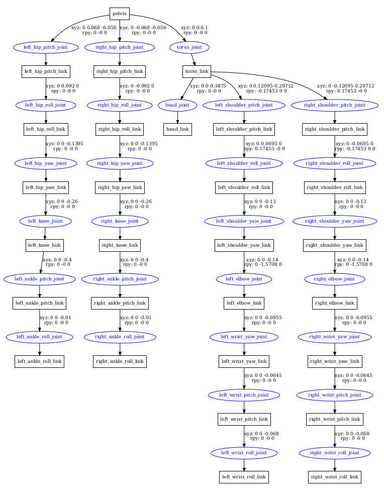

# Robots
This chapter introduces the robot platforms currently supported in Lumos RL Workspace.Lumos RL Workspace currently supports two humanoid robots: Lus2 and Nix1.
Both robots are described using modular configuration files and URDF/XML models, including detailed kinematics, joint limits, actuator properties, and mass distributions to ensure smooth simulation and accurate sim-to-real transfer. These resources are stored under the robot_models/ directory.
- Currently available models
  - Lus2: Full-sized humanoid robot
  - NIX1: Small-sized humanoid robot
Both robots are modeled with high-fidelity physics, including joint limits, actuator properties, and accurate mass distribution. This ensures realistic training dynamics and smoother transfer to real hardware.

## Device details

### Lus2

- Height:  1.6 m
- Weight:  57 kg
- Degrees of Freedom (DoF): 28
- Actuators: Position–torque actuators with compliant control

### Nix1

- Height: 0.886m
- Weight: 18 kg
- Degrees of Freedom (DoF): 21
- Actuators: Hybrid position–torque actuators with higher torque limits

