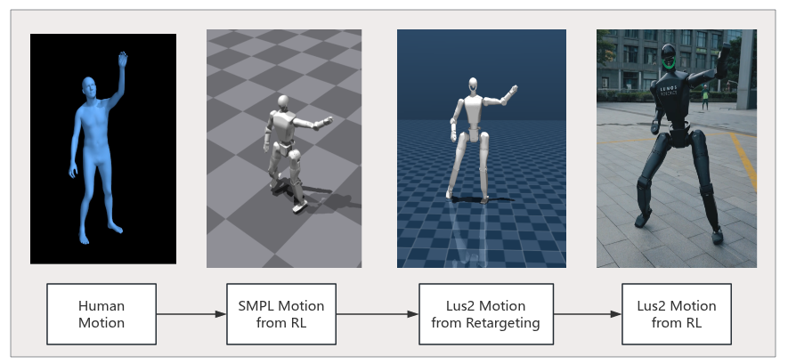
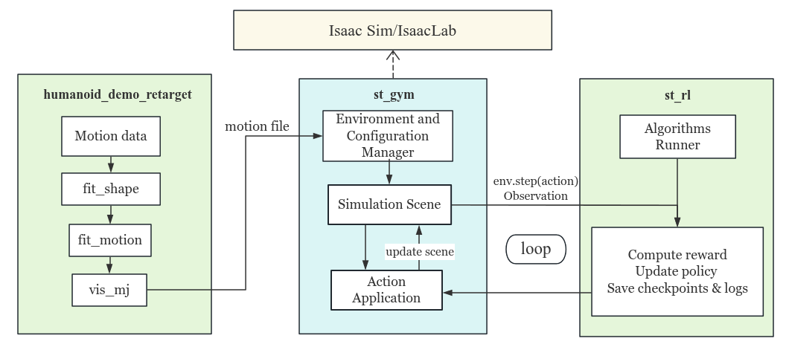

  
  
<b>Figure: Lus2 in World Robot Contest</b>

# Chapter 1. Home
Lumos RL Workspace is a modular reinforcement learning framework for legged locomotion, designed around the Lus and NIX humanoid robots.
Built on Isaac Lab, it decouples policy development from specific simulators, supporting seamless integration with both Isaac Sim and MuJoCo.
Key features include:
- Modularity & Flexibility – controllers are isolated from the simulator core, enabling easy extension and platform switching.
- Imitation-based Learning – with motion references and adaptive curricula, policies can capture natural, human-like movements.
- General Interfaces – velocity and style commands, reward terms, and robot-specific modules simplify adaptation to new robots.
- Evaluation & Benchmarking – standardized tests across terrains, tasks, and styles enable robustness, generalization, and sim-to-real studies.
In short, Lumos RL Workspace is a simulation-agnostic, extensible platform for advancing locomotion policy research and deployment.
Using this guide, you will be able to  retarget human motions, train locomotion policies, and deploy them to the Lus2 and Nix1 humanoid robots.

  
  
<b>Figure: Motion Retargeting and Real-World Deploymentt</b>

# Chapter 2. Robot Models
## 2.1 Supported Robots
This chapter introduces the robot platforms currently supported in Lumos RL Workspace.Lumos RL Workspace currently supports two humanoid robots: Lus2 and Nix1.
Both robots are described using modular configuration files and URDF/XML models, including detailed kinematics, joint limits, actuator properties, and mass distributions to ensure smooth simulation and accurate sim-to-real transfer. These resources are stored under the robot_models/ directory.
- Currently available models
  - Lus2: Full-sized humanoid robot
  - NIX1: Small-sized humanoid robot
Both robots are modeled with high-fidelity physics, including joint limits, actuator properties, and accurate mass distribution. This ensures realistic training dynamics and smoother transfer to real hardware.
## 2.2 Device details
Lus2
- Height:  1.6 m
- Weight:  57 kg
- Degrees of Freedom (DoF): 28
- Actuators: Position–torque actuators with compliant control

  
  
<b>Figure : Lus2 Joint Limits (in Radians, left side example)</b>

  
  
<b>Figure : Lus2  skeleton tree</b>

Nix1
- Height: 0.886m
- Weight: 18 kg
- Degrees of Freedom (DoF): 21
- Actuators: Hybrid position–torque actuators with higher torque limits

  
  
<b>Figure : Nix1 Overall Dimension Diagram</b>

  
  
<b>Figure : Nix1 skeleton tree</b>

# Chapter 3.  Projects
This chapter provides an overview of the two core projects in Lumos RL Workspace.Before diving into the details, the following diagram illustrates the relationship between the main components and their interactions:

  
  
<b>Figure: Project Relationship Diagram</b>

Each project has its own subpage with two parts:
1. Getting Started – Step-by-step guide for running demos and training policies.
2. Concepts & Principles – Technical details, mathematical background, and design philosophy.
Additional documentation will be added here progressively.
Setup

## 3.1 Trajectory Alignment
  from human motions to Lus2 & Nix1
- Focus: Motion retargeting from human trajectories to Lus2 and Nix1.
- Provides tools for trajectory alignment and dataset preprocessing.
- Bridges between human motion datasets and robot-compatible policies.
Example Result Video: Retargeted human motion trajectory executed on Lus2.

  
  
<b>Figure: Comparison of Retargeted Motion (CMU_CMU_13_13_21_poses)</b>

## 3.2 Policy Training
- Focus: Reinforcement learning–based policy for humanoid robots.
- Framework: Built on st_gym (Isaac Sim–based environments) and st_rl (RL algorithms).
- Key Features:
  - Multi-algorithm support: PPO, APPO, TPPO.
  - Reference Motion Imitation: Optional imitation rewards in different modes with various trajectories.
  - Configurable observation, action, and reward spaces for different tasks.
- Outcome: Trained control policies capable of robust humanoid motion in simulation.
Example Result Video: Trained motion policies on Lus2 in simulation.

  
  
<b>Figure:  Example Policy (Iteration: 20000, Motion File: dance1_subject2_fps25.pkl)</b>

The policy path:st_gym/logs/st_rl/lus2_flat/2025-07-27_15-13-37/exported/policy.onnx

